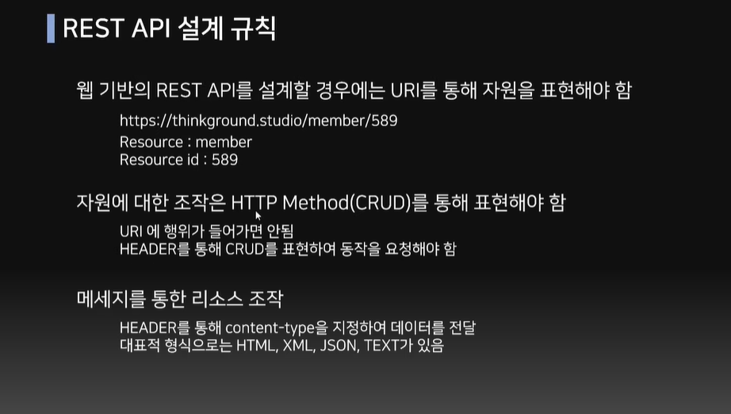
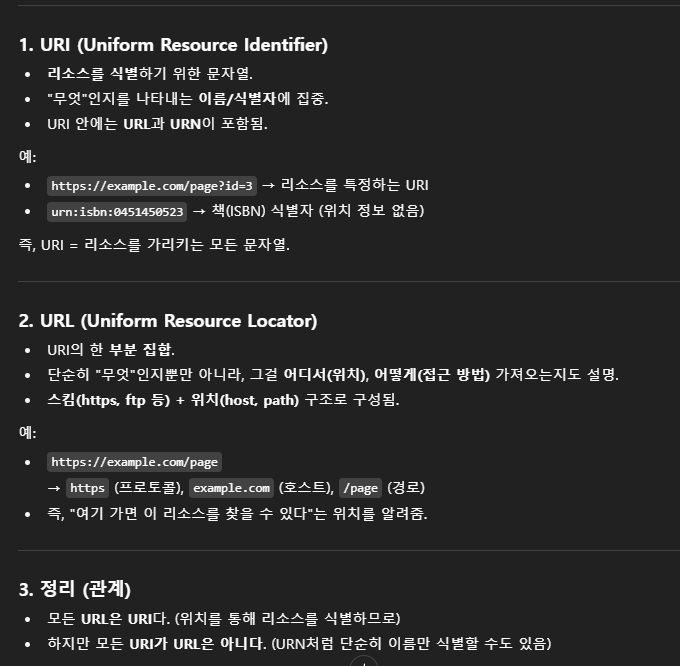

input       -> app      -> output
(controller)->(Service)->(Repository)-> output(Response)
### MVC pattern


@Controller

@RestController

```java
// controller package -> UserController class
// service와 닿아있는 레이어
import org.springframework.web.bind.annotation.GetMapping;
import org.springframework.web.bind.annotation.RestController;

@RestController
public class MemberController {

  @GetMapping("/hello") 
  public String getHello() {
    return "Hello!"; // -> localhost:8080/hello 치면 창에 Hello! 나오게 됨
  }

  // sign in
  @PostMapping("/join")
  public String join() {
    return "string";
  }
  // 어떤 값을 받을 것인가? -> Entity, 회원가입을 통해서 어떤 값들을 저장할 것인가

}
```
```java
// repository package -> Member class(Entity) / DB 상의 table
@Entity
@NoArgsConstructor
@AllArgsConstructor(access = AccessLevel.PRIVATE)
@Builder
@Getter
public class Member {
  @Id
  @GeneratedValue(strategy = GenerationType.IDENTITY) // auto_increment in DB
  private Long index; // primary key

  private String id;
  private String name;
  private String phoneNumber;
}
```
```java
// repository package -> MemberRepository
public interface MemberRepository extends JpaRepository<Member, Long>{

}
```
```java
// service package -> MemberService
public interface MemberService {
  String join(String id, String name, String phoneNumber); // 어떤 값을 받아야 하는지 -> entity class에 fields
}

// service package -> MemberServiceImpl => 위 인터페이스의 구현체
@Service
@RequiredArgsConstructor
public class MemberServiceImpl implements MemberService {

private final MemberRepository memberRepository;

  @Override
  public String join(String id, String name, String phoneNumber) {
    Member member = Member.builder()
            .id(id)
            .name(name)
            .phoneNumber(phoneNumber)
            .build()
    memberRepository.save(member);

    return "success";
  }

}
```
`Member → 관리할 엔티티 클래스 이름`  
`Long → Member 엔티티의 기본 키 타입`  
`<>`
Generic은 클래스나 메서드에서 다룰 데이터 타입을 일반화해서, 실제 사용할 때 원하는 타입으로 지정할 수 있게 해주는 기능.  
빌더 패턴 = parameter 순서 상관없이 필드명 명시하면 값 넣을 수 있음.
```java
// builder pattern ex
Member m = new Member.Builder()
        .city("Busan")
        .name("Seul")
        .phone("010-1111-2222")
        .age(25)
        .build();
```
✅ 
## API


- 여기서 인터페이스란 어떤 장치간 정보 교환 위한 수단이나 방법 의미
- 대표적인 인터페이스 예로는 마우스, 키보드, 터치패드 등
### RESTful API




URL vs. URI


endpoint = 클라이언트가 요청을 보낼 API 주소
- 예시:
```
GET /cars → 자동차 목록 조회
GET /cars/1 → id=1 자동차 조회
POST /cars → 자동차 추가
PUT /cars/1 → 자동차 수정
DELETE /cars/1 → 자동차 삭제
```
 
