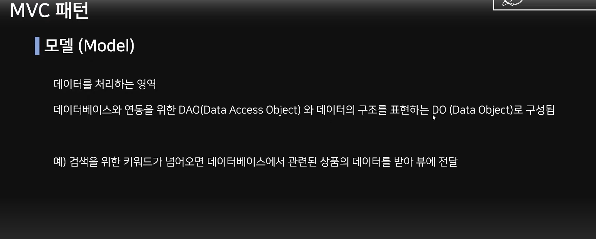
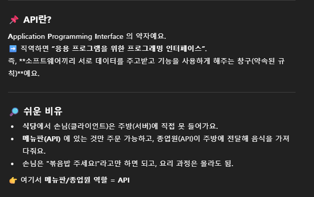
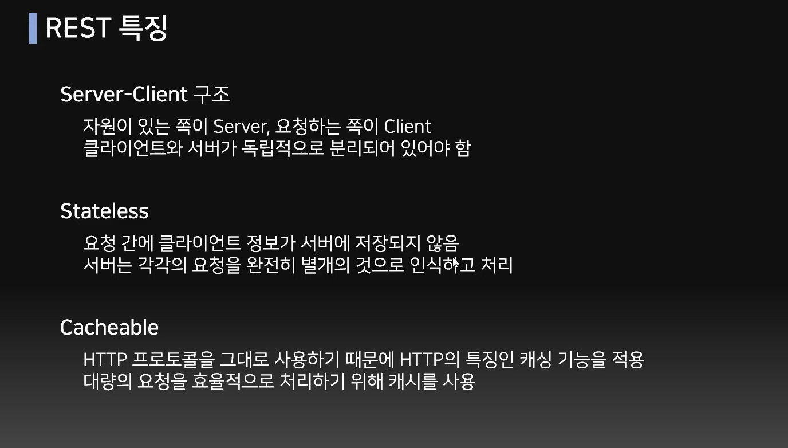

input       -> app      -> output
(controller)->(Service)->(Repository)-> output(Response)
### MVC pattern




@Controller

@RestController

```java
// controller package -> UserController class
import org.springframework.web.bind.annotation.GetMapping;
import org.springframework.web.bind.annotation.RestController;

@RestController
public class UserController {

  @GetMapping("/hello") 
  public String getHello() {
    return "Hello!"; // -> localhost:8080/hello 치면 창에 Hello! 나오게 됨
  }

  // sign in
  @PostMapping("/join")
  public String join() {
    return "string";
  }
  // 어떤 값을 받을 것인가? -> Entity, 회원가입을 통해서 어떤 값들을 저장할 것인가

}
```
```java
// repository package -> User class(Entity) / DB 상의 table
@Entity
@Builder
public class User {
  
}
```
✅ 
## API


- 여기서 인터페이스란 어떤 장치간 정보 교환 위한 수단이나 방법 의미
- 대표적인 인터페이스 예로는 마우스, 키보드, 터치패드 등
### RESTful API




endpoint = 클라이언트가 요청을 보낼 API 주소
- 예시:
```
GET /cars → 자동차 목록 조회
POST /cars → 자동차 추가
GET /cars/1 → id=1 자동차 조회
PUT /cars/1 → 자동차 수정
DELETE /cars/1 → 자동차 삭제
```